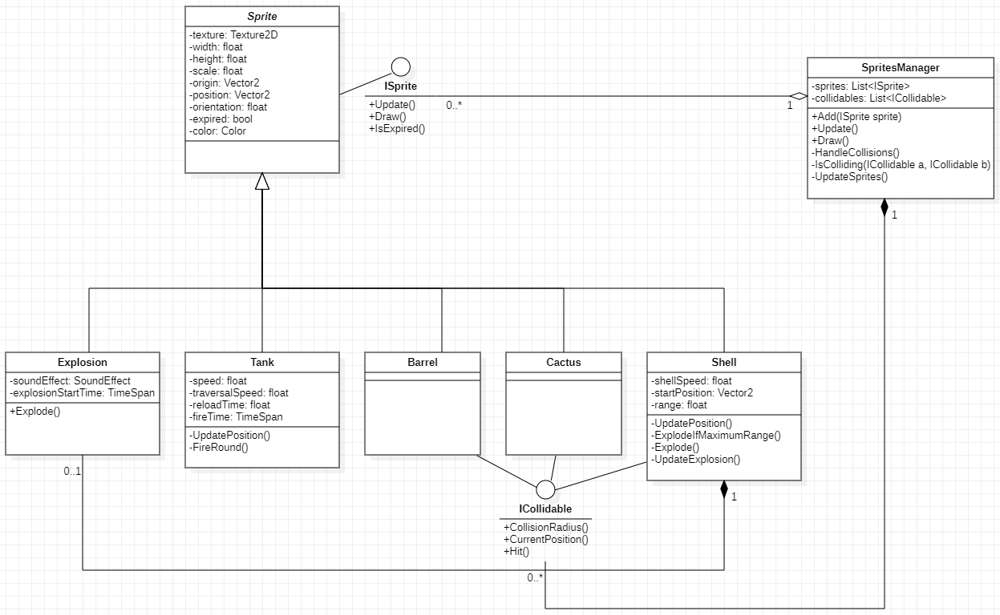

# Notes
A collection of development notes taken during design of the "Tanks" game.

- [Notes](#notes)
  - [24-01-2023](#24-01-2023)
    - [Features](#features)
      - [Tank](#tank)
      - [Barrel](#barrel)
      - [Cactus](#cactus)
      - [Shell](#shell)
    - [Proposed Design (UML Diagram)](#proposed-design-uml-diagram)

## 24-01-2023
### Features
#### Tank
- A tank whose position and orientation can be updated using keyboard input.
- The tank can also fire a shell at a specified interval (reload time) using keyboard input.
- The tank will have a texture of a specified scale to be drawn on the screen.

#### Barrel
- A barrel with a set position.
- The barrel will have a texture of a specified scale to be drawn on the screen.
- A round fired at a barrel should collide with it.

#### Cactus
- A cactus with a set position.
- The cactus will have a texture of a specified scale to be drawn on the screen.
- A round fired at a cactus should collide with it.

#### Shell
- The tank will fire a shell, which should travel at a specified velocity based on its speed and the tanks orientation.
- The shell will have a maximum range. If it reaches this range, it will explode.
- The shell will also explode if it collides with any collidable object that is on its path.
- The shell will have a texture of a specified scale to be drawn on the screen.
- Upon exploding, an explosion should be drawn on screen for a set duration.
- Upon exploding, an explosion sound should be played.

### Proposed Design (UML Diagram)

---
